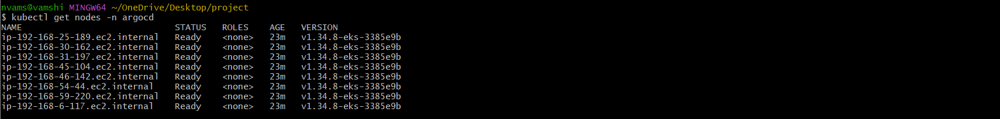

# Dockerized Tomcat Application

A custom Docker image built on Tomcat with a deployed web application,
role-based manager access, and external IP configuration.

## What This Does
- Builds a custom Tomcat image with application files baked in
- Configures tomcat-users.xml for role-based manager access
- Modifies context.xml to allow external IP access
- Exposes application on port 8080

## How to Build and Run
docker build -t my-tomcat .
docker run -d -p 8081:8080 --name tomcat-app my-tomcat

Access at http://localhost:8081

## Push to DockerHub
docker tag my-tomcat vamshi82/my-tomcat:latest
docker push vamshi82/my-tomcat:latest

## Screenshots

## Tech Stack
Docker • Tomcat • Bash • Linux
