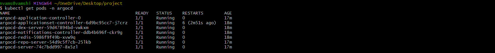
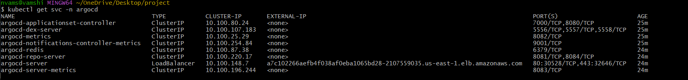

# Kubernetes Deployment Manifests

Kubernetes manifests to deploy the Dockerized Tomcat application
on EKS with LoadBalancer access and rolling update strategy.

## Files
- `deployment.yaml` — Deploys 2 replicas of vamshi82/my-tomcat:latest
- `service.yaml` — LoadBalancer service exposing the app externally

## How to Deploy Manually
kubectl apply -f deployment.yaml
kubectl apply -f service.yaml
kubectl rollout status deployment/tomcat-deploy

## How to Rollback
kubectl rollout undo deployment/tomcat-deploy
kubectl rollout history deployment/tomcat-deploy

## Rolling Update Strategy
- maxSurge: 1 — one extra pod created during update
- maxUnavailable: 0 — no pods go down during update
- Zero downtime deployments guaranteed

## Screenshots

## Tech Stack
Kubernetes • EKS • AWS • Docker
